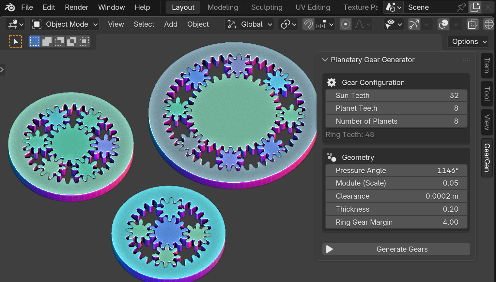
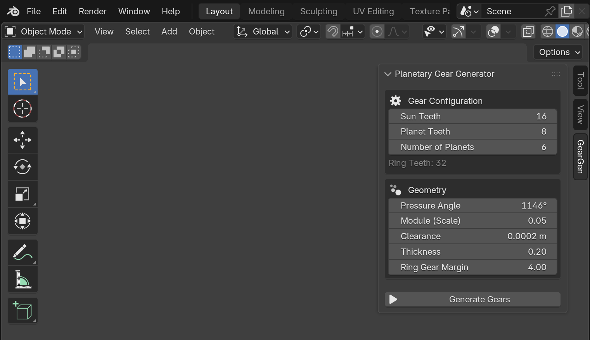

# Planetary Gear Generator for Blender

Blenderで遊星歯車（プラネタリーギア）のセットを生成するためのアドオンです。

## 使い方

1.  3Dビューポートで `N` キーを押してサイドバーを表示します。
2.  `GearGen` という名前のタブが追加されているので、それをクリックします。
3.  表示されたパネルで、好みのパラメータに設定します。
4.  `Generate Gears` ボタンを押すと、歯車が生成されます。

---

## インストール方法

1.  このリポジトリの [Releasesページ](https://github.com/kame404/planetary_gear_generator/releases/) から、最新版の `planetary_gear_generator.zip` をダウンロードします。
2.  Blenderにドラッグアンドドロップします。

---

## 主な設定項目

### Gear Configuration (歯車の構成)
*   **Sun Teeth (サンギアの歯数):** 中心の歯車（サンギア）の歯の数です。
*   **Planet Teeth (プラネットギアの歯数):** 周りを公転する歯車（プラネットギア）の歯の数です。
*   **Number of Planets (プラネットギアの数):** プラネットギアをいくつ配置するかを指定します。
*   **Ring Teeth (リングギアの歯数):** 上記の設定から自動的に計算され、表示されます。

### Geometry (ジオメトリ)
*   **Pressure Angle (圧力角):** 歯の面の角度です。値を大きくすると歯が太く、鋭くなります。
*   **Module (Scale) (モジュール):** 値が大きいほど、歯車全体が大きくなります。
*   **Clearance (クリアランス):** 歯車同士の隙間です。
*   **Thickness (厚み):** 生成される歯車の厚みです。
*   **Ring Margin (リングギアの余白):** リングギアの外周の厚みを指定します。

---

## クレジット

インボリュート歯形の生成アルゴリズムは、**Leemon Baird**氏によってパブリックドメインとして公開された「Parametric Involute Spur Gear」を元にしています。

また、そのアルゴリズムをJavaScriptで実装したWebアプリケーション「[Planetary Gear Simulator](https://www.thecatalystis.com/gears/)」を参考に、Pythonスクリプトとして移植しました。

## ライセンス

このアドオンのソースコードは MITライセンス とします。
